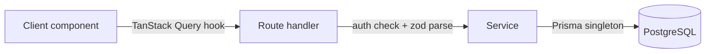

# Willow Tree Hotel

Hotel management system built for the Willow Tree Hotel (Scone, NSW):
bookings, rooms, staff, calendar, and reports behind a role-gated dashboard.

> **Status:** pre-launch. The app is under active development for a working
> boutique hotel. A public demo and screenshots are pending the current UI
> redesign.

<!-- TODO(readme): live demo — add once the public URL + demo credentials are ready
## Live demo

**URL:** https://...
**Credentials:** `demo@example.com` / `<password>` (read-only tour)
-->

<!-- TODO(readme): hero screenshot — add once the redesigned dashboard is stable

-->

## Stack

| Layer | Choice |
|---|---|
| Framework | Next.js 16 (App Router) + React 19 + TypeScript 5 |
| Database | PostgreSQL via Prisma 7 |
| Auth | NextAuth 4 (credentials + Prisma adapter), role-based |
| Server state | TanStack Query 5 |
| Validation | Zod 4 |
| UI | shadcn/ui (Radix + CVA) + Tailwind 4 |
| Rate limiting | Upstash Redis (edge) |
| Testing | Vitest 4 + jsdom + Testing Library |
| Deploy | Vercel |

## Notable engineering

Highlights of design decisions worth reading past the surface. Each bullet
links to the current implementation on `main`.

- **Timing-attack-hardened forgot-password.** Response time and body are
  identical whether the email exists or not, closing a common user-enumeration
  vector. See
  [`src/lib/services/password-reset-service.ts`](https://github.com/devjayzee/Scone-Willow-Tree-Hotel/blob/main/src/lib/services/password-reset-service.ts).
- **`AsyncLocalStorage` audit context.** Every mutation runs inside a
  per-request store carrying user id, IP, and user-agent, so services can
  audit without threading a context object through every call. See
  [`src/lib/utils/with-request-audit-context.ts`](https://github.com/devjayzee/Scone-Willow-Tree-Hotel/blob/main/src/lib/utils/with-request-audit-context.ts).
- **Layered architecture enforced by lint.** Route handlers only auth + parse;
  services own all Prisma access. Rules live in
  [`.claude/rules/`](https://github.com/devjayzee/Scone-Willow-Tree-Hotel/tree/main/.claude/rules)
  and are machine-enforced via
  [`eslint.config.mjs`](https://github.com/devjayzee/Scone-Willow-Tree-Hotel/blob/main/eslint.config.mjs).
- **Edge-proxy defence in depth.** Body-size cap, credential-login rate
  limit, and per-user API rate limit all run before any handler is reached.
  See
  [`src/proxy.ts`](https://github.com/devjayzee/Scone-Willow-Tree-Hotel/blob/main/src/proxy.ts).
- **Session revocation via `tokenVersion` bump.** JWT sessions can be
  invalidated server-side without waiting for cookie expiry — the `jwt`
  callback nulls `token.id` when the DB version has advanced. See
  [`src/lib/auth.ts`](https://github.com/devjayzee/Scone-Willow-Tree-Hotel/blob/main/src/lib/auth.ts).

## Architecture

Every API request follows the same three-layer flow:



- **Route handlers** do the session check and Zod `safeParse`, then delegate
  to exactly one service call and end with `handleApiError`. No business
  logic, no direct Prisma.
- **Services** own all Prisma access and throw domain errors
  (`NotFoundError`, `ConflictError`, `ForbiddenError`, …). HTTP- and
  session-free.
- **Client components** never `fetch` directly — they call TanStack Query
  hooks under `src/hooks/`, which call the API routes.
- **Server components** (dashboard pages) fetch initial data and serialize
  Prisma entities (`Date` → ISO string, `Decimal` → string) before handing
  them to `'use client'` leaves.

<!-- TODO(readme): secondary screenshots — calendar, staff, reports — add alongside hero -->

## Local setup

```bash
git clone https://github.com/devjayzee/Scone-Willow-Tree-Hotel.git
cd Scone-Willow-Tree-Hotel
npm install
cp .env.example .env  # fill in required vars — see below
npx prisma migrate dev
npx prisma db seed
npm run dev
```

Required environment variables are documented in `.env.example`:
`DATABASE_URL`, `DIRECT_URL`, `NEXTAUTH_SECRET`, `UPSTASH_REDIS_REST_URL`,
`UPSTASH_REDIS_REST_TOKEN`. Optional: `RESEND_API_KEY` + `EMAIL_FROM` for
transactional email (unset → emails log to console).

## Testing & CI

- `npm run test:run` — Vitest single run
- `npm run test:coverage` — coverage report
- `npm run lint` — ESLint (also enforces the architectural rules above)
- `npm run typecheck` — `tsc --noEmit`

The same suite runs on every pull request via GitHub Actions.

## Contact

Built by [@devjayzee17](https://github.com/devjayzee17). Reach out via
GitHub.

## License

MIT — see [LICENSE](LICENSE).
